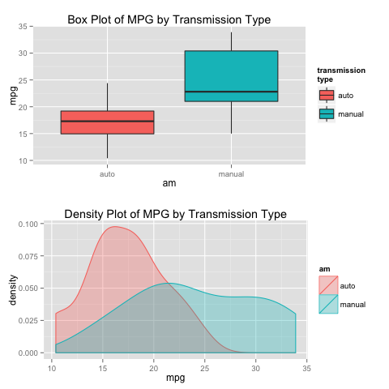
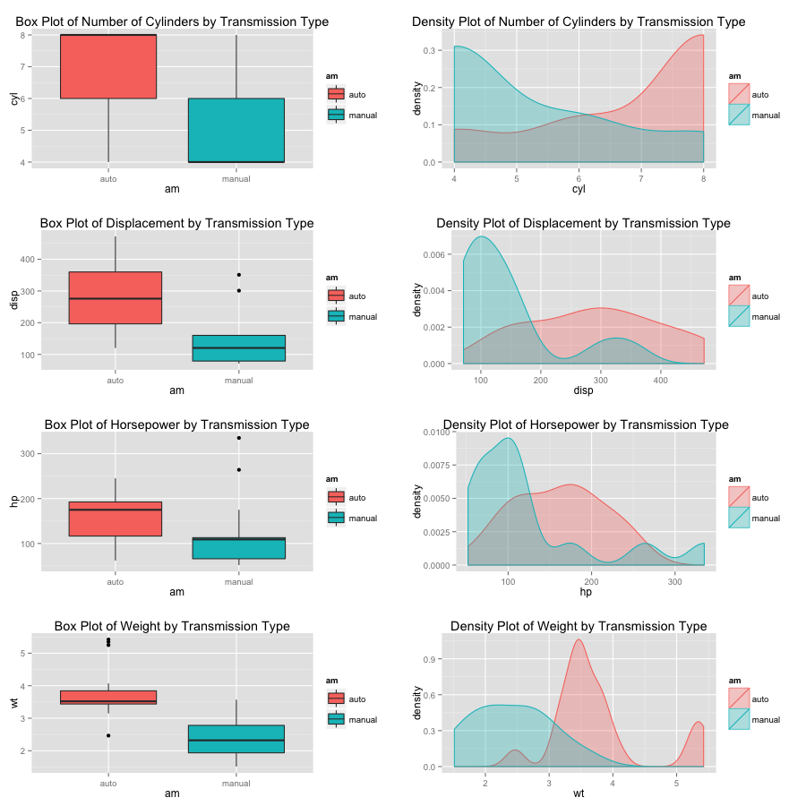
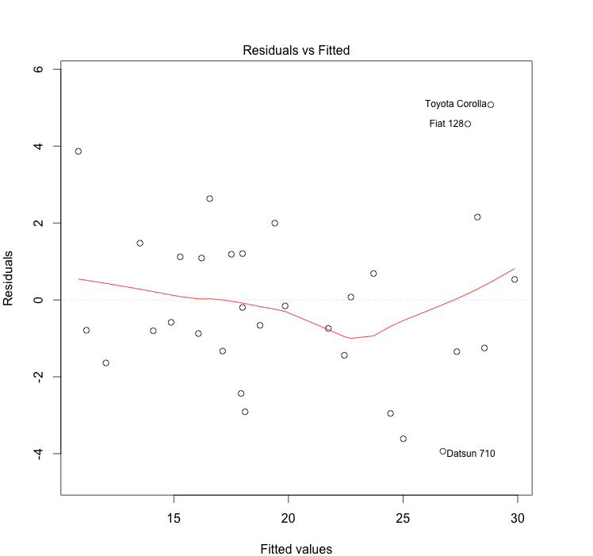

<h1>Analysis of Fuel Efficiency by Transmission Type</h1>

<h2>Objective</h2>
The goal of this regression analysis is to explore vehicles' fuel efficiency--measured by miles-per-gallon (MPG)--by transmission type (automatic or manual). This analysis will attempt to answer whether automatic or manual transmission cars have better MPGs. The analysis will also attempt to quantify the MPG difference between automatic- and manual-transmission vehicles.

<h2>About the Data</h2>
The data was extracted from the 1974 Motor Trend US magazine, and comprises fuel consumption and 10 aspects of automobile design and performance for 32 automobiles (1973–74 models). The dataset contains 32 observations on 11 variables.

- mpg: Miles/(US) gallon
- cyl: Number of cylinders
- disp: Displacement (cu.in.)
- hp: Gross horsepower
- drat: Rear axle ratio
- wt: Weight (lb/1000)
- qsec: 1/4 mile time
- vs: V/S
- am: Transmission (0 = automatic, 1 = manual)
- gear: Number of forward gears
- carb: Number of carburetors

```
## 'data.frame':  32 obs. of  11 variables:
##  $ mpg : num  21 21 22.8 21.4 18.7 18.1 14.3 24.4 22.8 19.2 ...
##  $ cyl : num  6 6 4 6 8 6 8 4 4 6 ...
##  $ disp: num  160 160 108 258 360 ...
##  $ hp  : num  110 110 93 110 175 105 245 62 95 123 ...
##  $ drat: num  3.9 3.9 3.85 3.08 3.15 2.76 3.21 3.69 3.92 3.92 ...
##  $ wt  : num  2.62 2.88 2.32 3.21 3.44 ...
##  $ qsec: num  16.5 17 18.6 19.4 17 ...
##  $ vs  : num  0 0 1 1 0 1 0 1 1 1 ...
##  $ am  : num  1 1 1 0 0 0 0 0 0 0 ...
##  $ gear: num  4 4 4 3 3 3 3 4 4 4 ...
##  $ carb: num  4 4 1 1 2 1 4 2 2 4 ...
```

First, the dataset was assigned to a variable called ``mtc``. Then, in order to make the analysis more human-readable, the coded values in the 'am' variable, 0s and 1s, were substituted with 'auto' and 'manual' using the script below.

```r
mtc$am <- factor(ifelse(mtc$am==0, 'auto', 'manual'))
```

The ``mtc`` dataset was also split into ``auto`` and ``manual`` datasets.

```r
auto <- subset(mtcars, am=='auto')
manual <- subset(mtcars, am=='manual')
```

<h2>Average MPG by Transmission Type</h2>
In order to see if there existed a notable difference in MPG between automatic and manual transmission vehicles, an average MPG was calculated for each transmission type. 

<b>MPG by transmission type</b>

```r
tapply(mtc$mpg, mtc$am, mean)  
```

```
##     auto   manual 
## 17.14737 24.39231
```

 

The result from a Mann-Whitney U test suggested that the difference in means between the two samples in MPGs was statistically significant. (Mann-Whitney U test was favored over independent t-test because the two samples failed to meet the assumption of homogeneity of variance.)

```r
## check for homogeneity of variance between two samples
leveneTest(mtcars$mpg ~ mtcars$am)  
# p-value < 0.05; homogeneity of variance not assumed
```

```r
## Mann-Whitney U test (non-parametric)
wilcox.test(auto$mpg, manual$mpg, paired = FALSE, exact = FALSE)  
# p-value < 0.05; the difference in MPG between the two samples is stat. sig.
```

<h2>Search for Potential Confounder</h2>
Because the difference in MPGs between automatic- and manual-transmission vehicles could be attributed to other variables, additional analyses were performed in search of potential confounders. 

```r
mean_auto <- sapply(auto[ , -9], mean)
mean_manual <- sapply(manual[ , -9], mean)
rbind(mean_auto, mean_manual)
```

```
##                  mpg      cyl     disp       hp     drat       wt     qsec        vs     gear     carb
## mean_auto   17.14737 6.947368 290.3789 160.2632 3.286316 3.768895 18.18316 0.3684211 3.210526 2.736842
## mean_manual 24.39231 5.076923 143.5308 126.8462 4.050000 2.411000 17.36000 0.5384615 4.384615 2.923077
```

It soon became apparent that the difference in MPGs between automatic- and manual-transmission vehicles could be attributed to other vehicular features. Specifically, automatic transmission cars, on average, had:

- more cylinders
- larger engine displacement
- more horsepower
- heavier weight

All of these factors could potentially explain why vehicles with automatic transmissions logged lower MPGs than the manual-transmission counterparts. 

 


<h2>Building Models</h2>

Two models were created and analyzed. The first model, ``model1``, estimated vehicles' MPG in function of the "am" variable only. The second model, ``model2``, incorporated potential confounders ("wt", "cyl", "disp", and "hp") in its formula to estimate vehicles' MPG.

```r
model1 <- lm(mpg ~ am, mtc)
model2 <- lm(mpg ~ wt + cyl + disp + hp + am, mtc)
```

Not taking other variables into account, ``model1`` showed an expected 7.24 MPG increase in manual-transmission vehicles over auto-transmission vehicles, which was statistically significant (p < 0.05).

```r
summary(model1)$coef
```

```
##              Estimate Std. Error   t value     Pr(>|t|)
## (Intercept) 17.147368   1.124603 15.247492 1.133983e-15
## ammanual     7.244939   1.764422  4.106127 2.850207e-04
```

The second model, ``model2``, however, took "wt", "cyl", "disp", and "hp" variables into account. Holding these variables fixed (i.e. with everything else being equal), the model showed an expected 1.56 MPG increase for manual-transmission cars over automatic-transmission cars. However, this estimate was not statistically significant. 

```r
summary(model2)$coef
```

```
##                Estimate Std. Error   t value     Pr(>|t|)
## (Intercept) 38.20279869 3.66909647 10.412045 9.084987e-11
## wt          -3.30262301 1.13364263 -2.913284 7.256888e-03
## cyl         -1.10637984 0.67635506 -1.635797 1.139322e-01
## disp         0.01225708 0.01170645  1.047036 3.047194e-01
## hp          -0.02796002 0.01392172 -2.008374 5.509659e-02
## ammanual     1.55649163 1.44053603  1.080495 2.898430e-01
```

To make sure that the second model, ``model2``, satisfied the heteroscedasticity condition, the residuals from the model were plotted against the fitted values.

 


<h2>Conclusion</h2>
In the dataset, vehicles with manual transmissions averaged higher MPGs than those with automatic transmissions. The mean MPG for automatic-transmission vehicles was 17.1 MPG while the mean MPG for manual-transmission vehicles was 24.4 MPG. 

However, a further analysis showed that the dataset contained a few confounders. Specifically, the automatic-transmission vehicles (on average) tended to be heavier, had more horsepower, had more cylinders, and had larger engine displacement than the manual-transmission counterparts. All of these variables could have contributed to the difference in MPG between automatic- and manual-transmission vehicles. 

A regression analysis was performed to address this problem. A linear regression model was created that incorporated all of the potential confounders into its formula. The result showed that, with everything else being equal, there was an expected 1.56 MPG increase for manual-transmission vehicles over automatic-transmission vehicles. This estimate, however, was not statistically significant. 

A further research with large data points will be needed for a more conclusive result. It should be noted that the dataset for this analysis contained only 32 observations, which is relatively small.